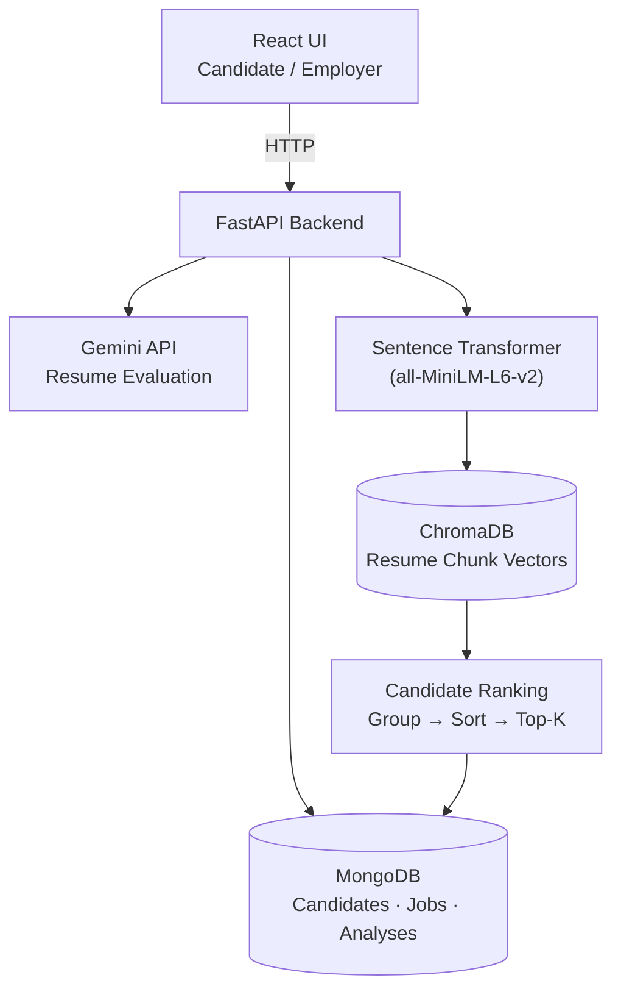

# 📄 Resume Evaluation & Candidate Management System

> A full-stack AI platform that evaluates resumes against job descriptions and helps employers discover the most relevant candidates from a resume pool — using an LLM, vector search, and classic ranking algorithms.

Built with **React · FastAPI · MongoDB · Gemini API · ChromaDB · Sentence Transformers**

---

## 🧠 How It Works



## 👥 Two Workflows

**Candidate** — uploads a resume + a job description and gets back an AI-generated evaluation: match score, compatibility breakdown, matched/missing skills, and improvement suggestions.

**Employer** — posts a job, and the system semantically retrieves and ranks the strongest-matching candidates from the indexed resume pool, without anyone manually reading every resume:

```text
Job Description → Embedding → Vector Search → Relevant Resume Chunks
                → Candidate Aggregation → Ranking → Top Candidates
```

## ⚙️ Key Features

- **AI-Powered Resume Evaluation** — Gemini generates an overall score, a 5-dimension metrics breakdown (skills match, experience relevance, keyword density, project alignment, communication clarity), matched/missing/bonus skills, and prioritized improvement suggestions.
- **Semantic Candidate Search** — a job description is embedded and matched against indexed resume chunks in ChromaDB by meaning, not just keywords.
- **Chunk-Level Resume Indexing** — resumes are split into overlapping chunks (via LangChain's `RecursiveCharacterTextSplitter`) before embedding, so different sections of a resume can independently match different parts of a job description.
- **DSA-Driven Candidate Ranking** — retrieved chunks are grouped by `candidate_id` into a hash map, each candidate's strongest-matching distances are sorted, and candidates are ranked by their best average distance.
- **Multi-Format Resume Parsing** — accepts PDF, DOCX, and TXT uploads.
- **Persistent Storage** — MongoDB holds structured data (candidates, jobs, analyses); ChromaDB is a dedicated semantic index for resume-chunk vectors.

## 🔍 Chunk-Level Indexing

```text
Candidate Resume
      ├── Chunk 0 → Embedding → ChromaDB
      ├── Chunk 1 → Embedding → ChromaDB
      ├── Chunk 2 → Embedding → ChromaDB
      └── Chunk N → Embedding → ChromaDB
```

Each vector is stored with `candidate_id` and `chunk_index` metadata, so a retrieved chunk can always be traced back to its candidate.

## 🏆 Candidate Ranking Algorithm

```text
1. Embed the job description
2. Semantic search over indexed resume chunks (ChromaDB)
3. Group matched chunks by candidate_id           → dict[candidate_id, distances]
4. Sort each candidate's distances, keep the best K
5. Average the best-K distances → candidate score
6. Sort all candidates by score (lower distance = stronger match)
7. Fetch full candidate records from MongoDB for the top results
```

## 🛠️ Tech Stack

| Layer | Technology |
|---|---|
| Frontend | React, React Router, Axios, Vite, CSS Modules |
| Backend | Python, FastAPI, Pydantic, Uvicorn |
| AI / LLM | Gemini API (resume evaluation, skill extraction) |
| Embeddings | Sentence Transformers (`all-MiniLM-L6-v2`) |
| Vector Store | ChromaDB, LangChain Text Splitters |
| Database | MongoDB (Motor async driver) |
| File Parsing | pypdf, python-docx |

## 📁 Project Structure

```text
resume-evaluation-candidate-management-system/
├── backend/
│   └── resume-analyzer/
│       ├── app/
│       │   ├── api/          # resume.py, jobs.py, health.py
│       │   ├── core/         # config.py, database.py
│       │   ├── models/       # schemas.py (Pydantic models)
│       │   ├── services/     # gemini_service, db_service, candidate_service,
│       │   │                 # job_service, resume_chunker, embedding_service,
│       │   │                 # vector_store, resume_ingestion, candidate_retrieval
│       │   └── utils/        # file_parser.py
│       ├── main.py
│       ├── requirements.txt
│       └── .env.example
├── Frontend/
│   └── src/
│       ├── api/               # client.js
│       ├── components/        # Layout, ScoreCard
│       ├── pages/             # Analyze, Employer, History, Results
│       ├── App.jsx
│       └── main.jsx
└── README.md
```

## 🚀 API Reference

| Method | Endpoint | Description |
|---|---|---|
| `GET` | `/api/health` | Service + database connectivity check |
| `POST` | `/api/resume/analyze` | Analyze resume text against a job description |
| `POST` | `/api/resume/analyze/upload` | Upload a resume file (PDF/DOCX/TXT) + job description |
| `POST` | `/api/resume/extract-skills` | Extract categorized skills from resume text only |
| `GET` | `/api/resume/history` | List past analyses (filterable by `user_id`) |
| `GET` | `/api/resume/{analysis_id}` | Fetch a single stored analysis |
| `DELETE` | `/api/resume/{analysis_id}` | Delete a stored analysis |
| `POST` | `/api/jobs/` | Create and persist an employer job |
| `GET` | `/api/jobs/{job_id}/matches` | Run semantic retrieval + ranking for a job |

**`POST /api/resume/analyze` — request**

```json
{
  "resume_text": "John Doe\nSoftware Engineer\n5 years Python experience...",
  "job_description": "We are looking for a Senior Python Developer..."
}
```

**Response**

```json
{
  "overallScore": 82,
  "verdict": "Strong Match",
  "candidateName": "John Doe",
  "metrics": {
    "skillsMatch": 88,
    "experienceRelevance": 75,
    "keywordDensity": 84,
    "projectAlignment": 90,
    "communicationClarity": 80
  },
  "matchedSkills": ["Python", "React.js", "MongoDB", "FastAPI"],
  "missingSkills": ["Docker", "Kubernetes"],
  "bonusSkills": ["Gemini API", "LangChain"],
  "suggestions": [
    { "priority": "high", "title": "Add Docker experience", "detail": "..." }
  ],
  "summary": "Strong candidate with excellent project alignment..."
}
```

**`GET /api/jobs/{job_id}/matches` — response**

```json
{
  "job_id": "6aa4e7b2a35106a2476369d5",
  "candidates": [
    { "candidate_id": "...", "name": "Jane Smith", "distance": 0.427, "matched_chunks": 3 },
    { "candidate_id": "...", "name": "Alex Kumar", "distance": 0.556, "matched_chunks": 3 }
  ]
}
```

## ⚡ Getting Started

### Backend

```bash
cd backend/resume-analyzer
python -m venv venv && source venv/bin/activate
pip install -r requirements.txt

cp .env.example .env
# edit .env — add GEMINI_API_KEY and MONGODB_URL

uvicorn main:app --reload --port 8000
```

Make sure MongoDB is running (locally, or point `MONGODB_URL` at Atlas). API docs: `http://localhost:8000/docs`

### Frontend

```bash
cd Frontend
npm install
npm run dev
```

Runs at `http://localhost:5173`.

## 🤔 Engineering Decisions

**Why chunk resumes instead of embedding the whole thing?**
Embedding an entire resume into a single vector loses local detail. Chunking lets different sections of a resume independently match different parts of a job description.

**Why ChromaDB alongside MongoDB?**
The two stores have different jobs. MongoDB is the source of truth for structured data (candidates, jobs, analyses); ChromaDB is a dedicated similarity-search index over resume-chunk vectors — `Structured Data → MongoDB`, `Semantic Index → ChromaDB`.

**Why group results by candidate after retrieval?**
Vector search naturally operates at the chunk level, but employers need candidate-level results. The `candidate_id` stored in each chunk's metadata is what makes it possible to fold chunk-level hits back into a ranked candidate list.

## ✅ Current Status

**Completed**
- [x] Resume text extraction (PDF/DOCX/TXT)
- [x] LLM-based resume evaluation, scoring, and skill extraction
- [x] MongoDB persistence + analysis history
- [x] Resume chunking, embeddings, and ChromaDB indexing
- [x] Job creation, semantic candidate retrieval, and ranking
- [x] React dashboard for both candidate and employer flows

**Planned**
- [ ] Authentication and role-based authorization (candidate vs. employer)
- [ ] Candidate/employer resource ownership enforcement
- [ ] Improved ranking and scoring strategies
- [ ] Production deployment

## 💡 Why This Project

Traditional resume screening leans heavily on keyword matching. This project explores a more intelligent pipeline:

```text
Keyword Matching → Semantic Retrieval → Chunk-Level Matching
                 → Candidate Aggregation → Algorithmic Ranking
```

It combines LLM-based reasoning, vector search, database design, and classic data-structures thinking (hash-map aggregation, sorting, top-K selection) into one practical full-stack application.

## Author

**Danish Arshid**